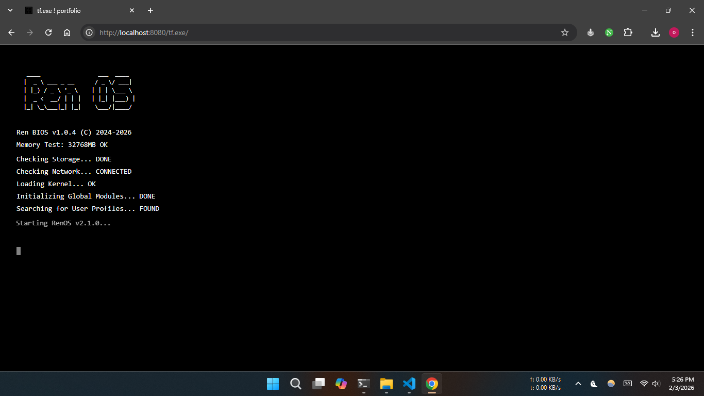
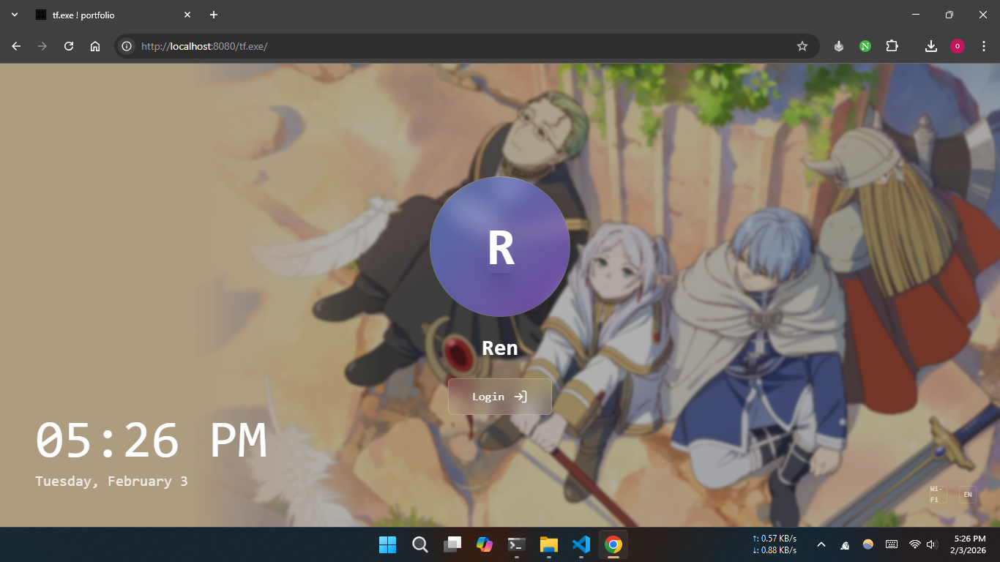
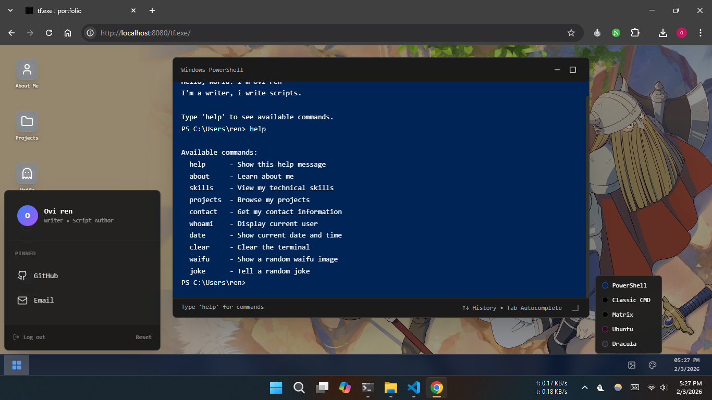
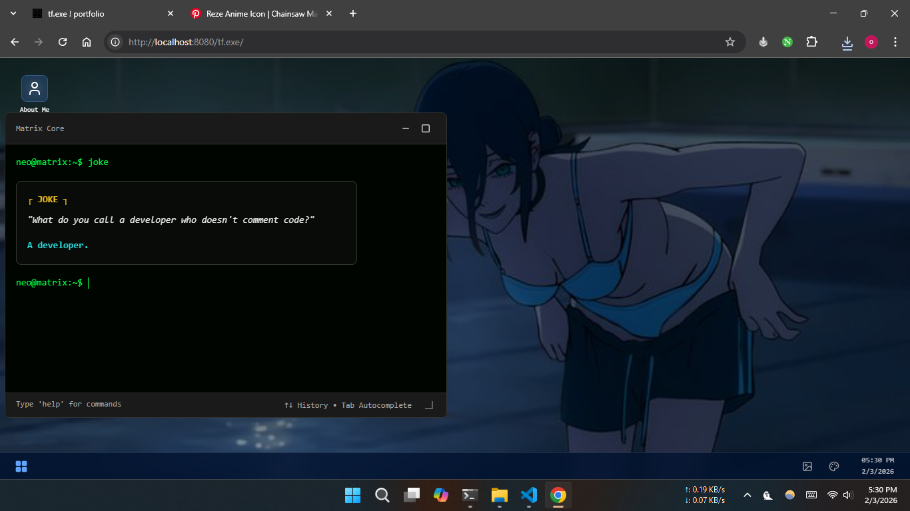

`tfish` is a stunning, fully interactive terminal-based portfolio website that simulates a complete operating system experience. Built with React, TypeScript, and Vite, this template transforms your portfolio into an immersive desktop environment with a BIOS boot sequence, login screen, draggable icons, and a functional terminal.


**[https://iamovi.github.io/tfish/](https://iamovi.github.io/tfish/)**

## Screenshots

<table>
  <tr>
    <td></td>
    <td></td>
  </tr>
  <tr>
    <td></td>
    <td></td>
  </tr>
</table>

## Installation

### Prerequisites
- Node.js 18+ or Bun
- npm, yarn, or bun

### Quick Start

```bash
# Clone the repository
git clone https://github.com/iamovi/tfish.git
cd tf.exe

# Install dependencies
npm install
# or
bun install

# Start development server
npm run dev
# or
bun dev

# Build for production
npm run build
# or
bun run build
```

The app will be available at `http://localhost:5173`

## 🎨 Customization Guide

### 1. Personal Information

Edit `src/components/Terminal.tsx` to update your details:

```tsx
// Update the welcome message
const WELCOME_MESSAGE = `Hello, World! I'm [Your Name]
I'm a [Your Title/Role].

Type 'help' to see available commands.`;

// Update the about command
about: {
  description: 'Learn about me',
  action: () => (
    <div className="my-4 space-y-4">
      <div className="border border-border rounded-lg overflow-hidden w-64 bg-secondary/50 shadow-lg">
        
      </div>
      <div className="font-mono leading-relaxed bg-secondary/30 p-4 border border-border rounded-lg">
        <div className="text-terminal-cyan font-bold mb-2">┌ ABOUT ME ┐</div>
        <p className="mb-4 text-foreground/90">
          Your bio here...
        </p>
      </div>
    </div>
  ),
},
```

### 2. Skills

Update your technical skills in the `skills` command:

```tsx
skills: {
  description: 'View my technical skills',
  action: () => `
┌─────────────────────────────────────────────────────────────┐
│  TECHNICAL SKILLS                                           │
├─────────────────────────────────────────────────────────────┤
│                                                             │
│  Languages                                                  │
│  ─────────────────────────────────────────────                  │
│  • Your Language 1                                          │
│  • Your Language 2                                          │
│                                                             │
│  Frameworks & Libraries                                     │
│  ─────────────────────────────────────────                  │
│  • Your Framework 1                                         │
│  • Your Framework 2                                         │
│                                                             │
└─────────────────────────────────────────────────────────────┘
`,
},
```

### 3. Projects

Update the `projects` command with your work:

```tsx
projects: {
  description: 'Browse my projects',
  action: () => `
┌─────────────────────────────────────────────────────────────┐
│  FEATURED PROJECTS                                          │
├─────────────────────────────────────────────────────────────┤
│                                                             │
│  01. Your Project Name                                      │
│      ──────────────────────────────────                     │
│      Project description here                               │
│      → github.com/yourusername/project                      │
│                                                             │
└─────────────────────────────────────────────────────────────┘
`,
},
```

### 4. Contact Information

Update your contact details:

```tsx
contact: {
  description: 'Get my contact information',
  action: () => `
┌─────────────────────────────────────────────────────────────┐
│  CONTACT                                                    │
├─────────────────────────────────────────────────────────────┤
│                                                             │
│  📧 Email      your.email@example.com                       │
│  🐙 GitHub     github.com/yourusername                      │
│  🐦 Twitter    twitter.com/yourusername                     │
│  🌐 Website    yourwebsite.com                              │
│                                                             │
└─────────────────────────────────────────────────────────────┘
`,
},
```

### 5. Username

Change the terminal username in `src/components/Terminal.tsx`:

```tsx
// Find these lines and replace 'ren' with your username
prompt: 'yourusername@ubuntu:~$',
prompt: 'C:\\Users\\yourusername>',
prompt: 'PS C:\\Users\\yourusername>',
```

### 6. Login Screen

Update the login screen in `src/components/LoginScreen.tsx`:

```tsx
<h1 className="text-3xl font-semibold text-white mb-2 drop-shadow-lg">
  Your Name
</h1>
```

### 7. Start Menu

Update the start menu profile in `src/components/SocialLinks.tsx`:

```tsx
<div className="text-sm font-semibold text-white">Your Name</div>
<div className="text-[11px] text-white/50">Your Title</div>
```

### 8. Default Wallpaper

Replace `public/frieren.jpg` with your own image, or update the default in `src/pages/Index.tsx`:

```tsx
const [wallpaper, setWallpaper] = useState<string | null>('/your-image.jpg');
```

### 9. Desktop Icons

Customize icons in `src/components/DesktopIcons.tsx`:

```tsx
const icons = [
  { icon: User, label: 'About Me', command: 'about', pos: { x: 20, y: 20 } },
  { icon: Folder, label: 'Projects', command: 'projects', pos: { x: 20, y: 120 } },
  // Add or remove icons as needed
];
```

### 10. Add Custom Commands

Add new commands in `src/components/Terminal.tsx`:

```tsx
const COMMANDS: Record<string, { description: string; action: () => string | React.ReactNode }> = {
  // ... existing commands
  
  yourcmd: {
    description: 'Your command description',
    action: () => 'Your command output',
  },
};
```

Don't forget to add it to the help menu!

## 🎭 Theme Customization

Themes are defined in `src/components/Terminal.tsx`. Add your own:

```tsx
case 'yourtheme':
  return {
    bg: '#000000',           // Background color
    text: '#ffffff',         // Text color
    prompt: 'user@host:~$',  // Command prompt
    header: 'Your Theme',    // Window title
    welcome: WELCOME_MESSAGE,
    caret: '#ffffff'         // Cursor color
  };
```

Then add it to the theme selector in `src/components/SocialLinks.tsx`:

```tsx
const themes = [
  // ... existing themes
  { name: 'Your Theme', color: '#000000', id: 'yourtheme' },
];
```

---

## Deployment

### Vercel
```bash
npm run build
# Deploy the 'dist' folder to Vercel
```

### Netlify
```bash
npm run build
# Deploy the 'dist' folder to Netlify
```

### GitHub Pages
```bash
npm run build
# Push the 'dist' folder to gh-pages branch
```

## Contributing

Contributions are welcome! Feel free to:
- Report bugs
- Suggest new features
- Submit pull requests
- Improve documentation

## License

This project is open source and available under the [MIT License](LICENSE).


**Made with ❤️ by [Ovi ren](https://iamovi.github.io), for developers**

Star ⭐ this repo if you found it helpful!

Thanks for reading!
